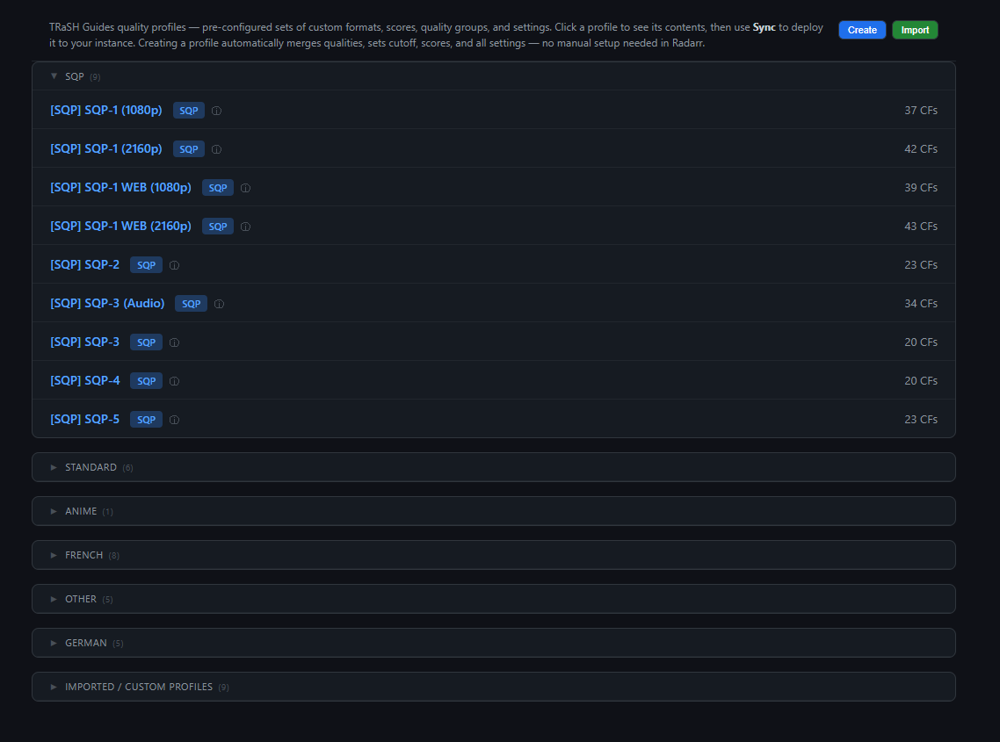
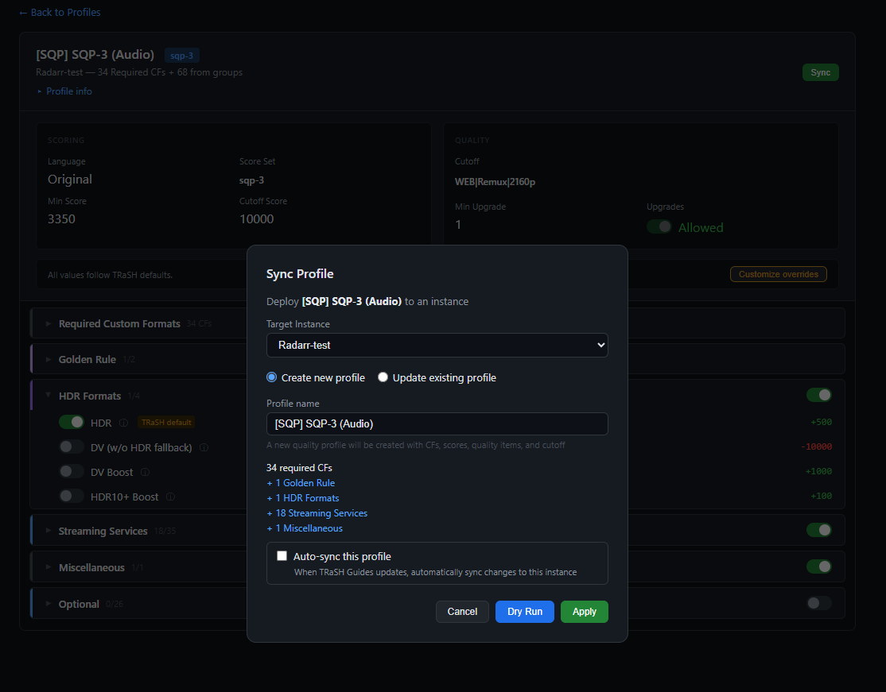
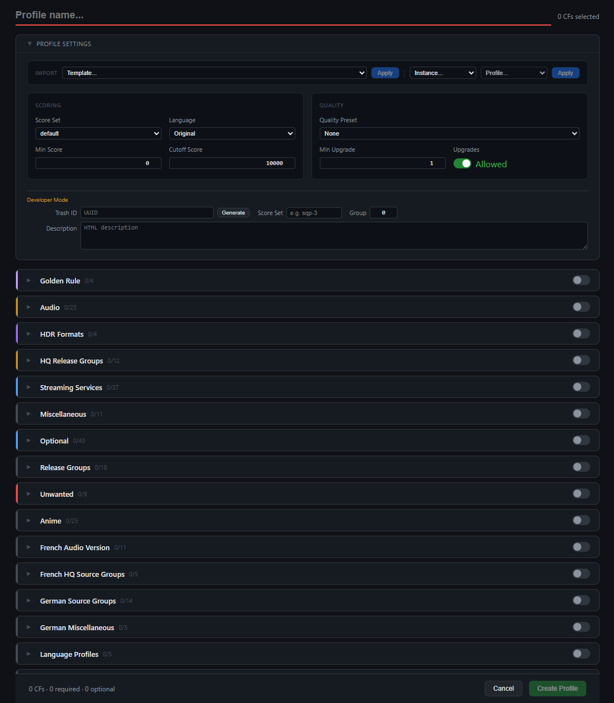
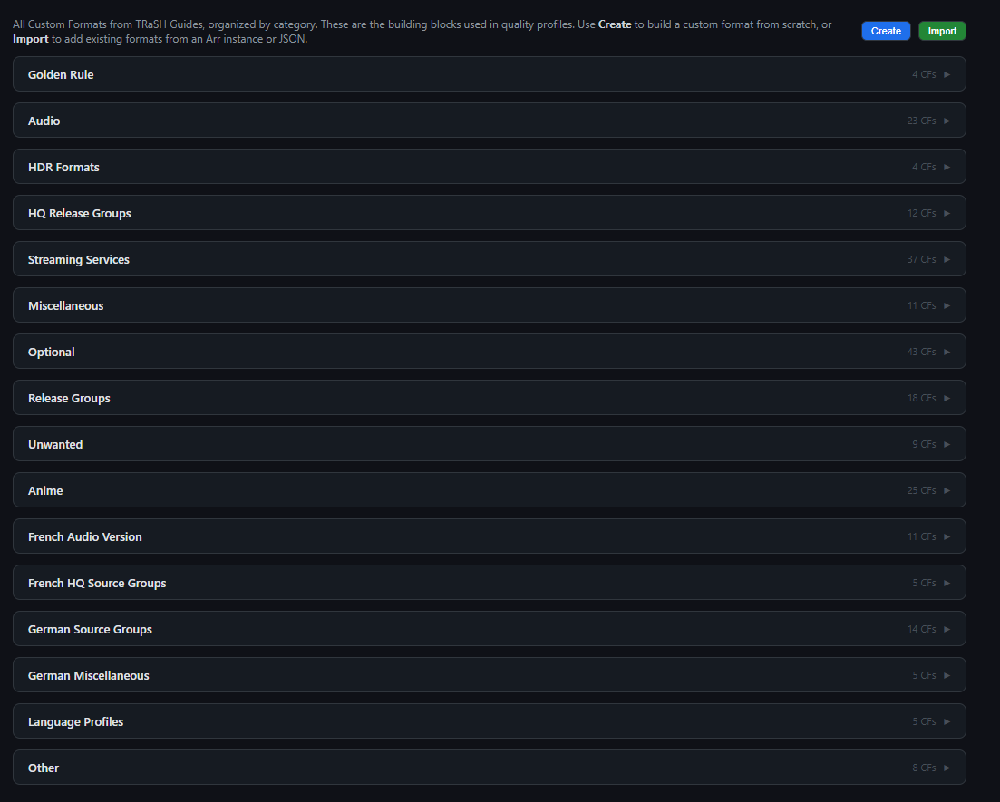
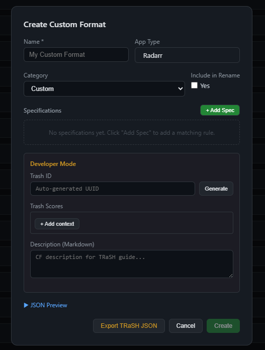
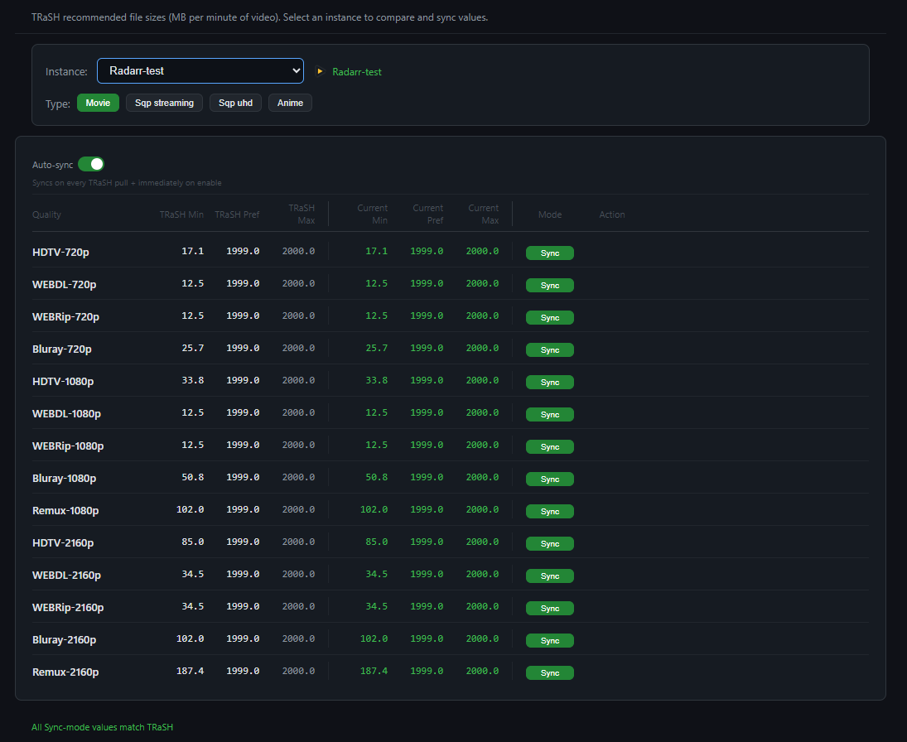
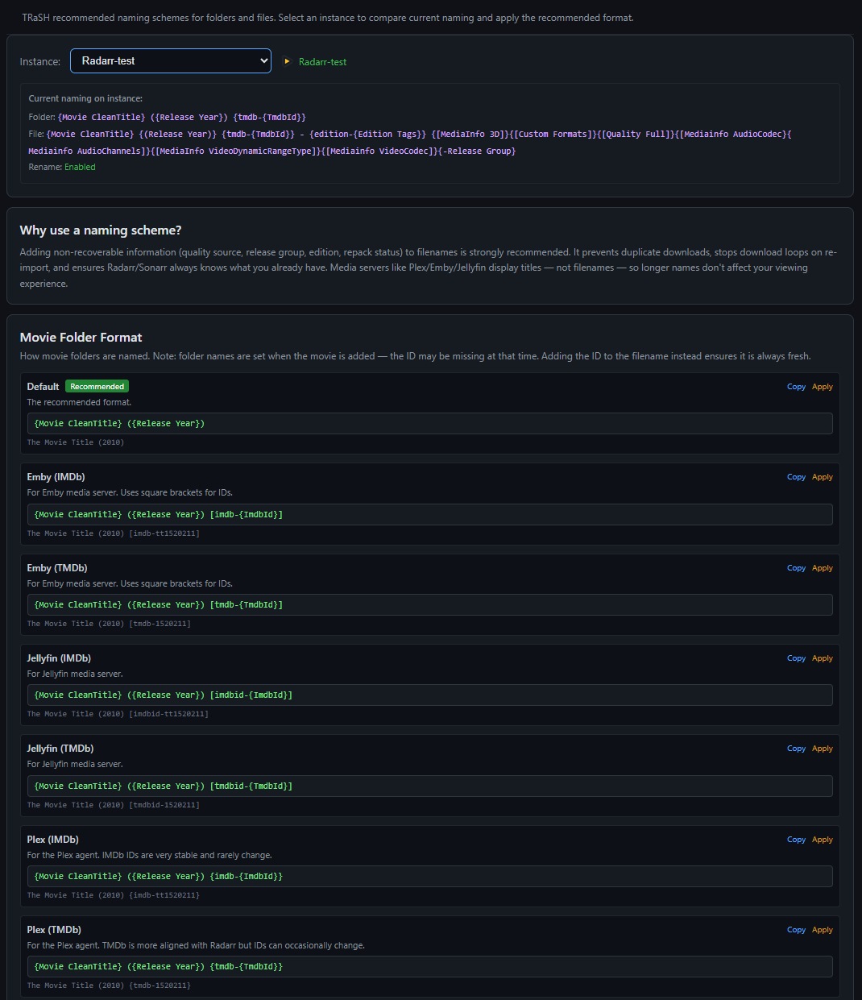
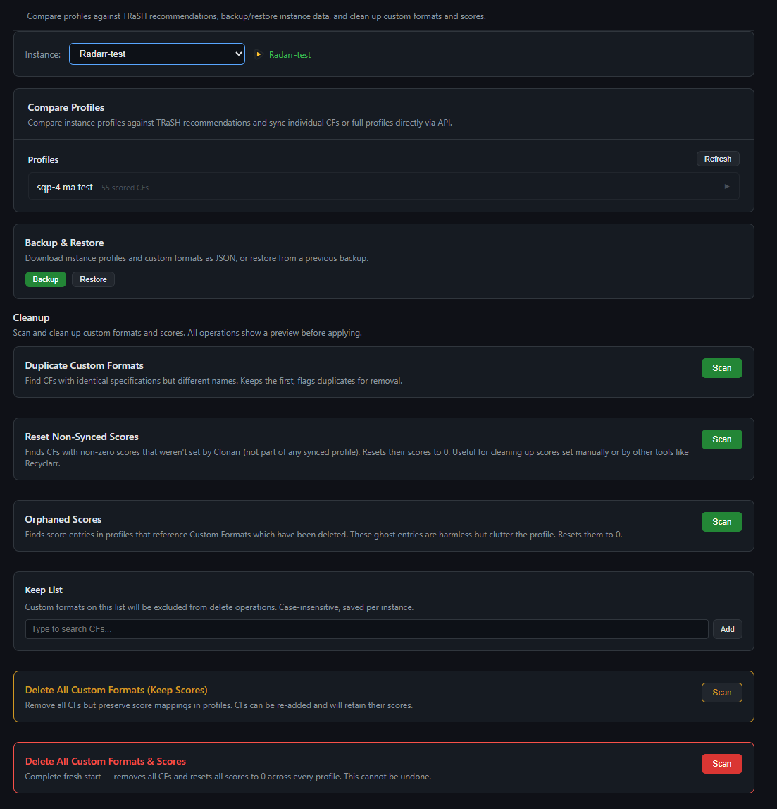

# Clonarr

> **Beta Software** — Clonarr is under active development. Features may change, and bugs are expected. Please report issues on [GitHub](https://github.com/prophetse7en/clonarr/issues).

A TRaSH Guides sync tool for Radarr and Sonarr with a built-in web UI. Browse, customize, and sync Custom Formats, Quality Profiles, Scores, and Quality Sizes — no YAML configs, no CLI, just a browser.

Built as an alternative to config-driven tools like Recyclarr, with a visual interface for building, testing, and deploying TRaSH profiles.

## Screenshots

| Profiles | Profile Sync |
|----------|-------------|
|  |  |

| Profile Creator | Custom Formats |
|----------------|----------------|
|  |  |

| CF Creator | Quality Size |
|-----------|-------------|
|  |  |

| File Naming | Maintenance |
|------------|-------------|
|  |  |

## Features

### Profile Sync
- Browse all TRaSH Quality Profiles (SQP-1 through SQP-5, HD Bluray, UHD Remux, Anime, language-specific, and more)
- Sync profiles to Radarr/Sonarr — creates quality groups, sets cutoff, applies CF scores
- **Create** new profiles or **Update** existing ones with dry-run preview
- **Sync behavior rules** (Add/Remove/Reset) — control how sync handles missing CFs, score overrides, and removed CFs
- **Override system** — customize language, scores, cutoff, and upgrades per-instance without modifying the TRaSH profile
- **Auto-sync** — automatically sync when TRaSH Guides updates, with Discord notifications

### Custom Formats
- Browse all TRaSH Custom Formats organized by category (Audio, HDR, Streaming, Unwanted, etc.)
- Compare profiles against TRaSH — see what's matching, wrong scores, missing, or extra. Sync individual fixes or all at once. Works best with profiles synced via Clonarr.
- Create and update CFs with spec-level comparison
- **CF Creator** — build custom CFs with regex specs, test patterns, and TRaSH-compatible scoring

### Profile Builder
- Build custom profiles from scratch or start from a TRaSH template
- Import from existing Arr instance profiles
- **TRaSH group system** — formatItems (mandatory CFs) + CF groups (optional, toggleable)
- **Three-state CF pills** — Req (required in group), Opt (optional in group), Fmt (in formatItems)
- Each TRaSH CF group shown as separate card with group-level and per-CF state controls
- Golden Rule and Miscellaneous variant dropdowns
- **Export** — TRaSH JSON (strict official format) + optional group includes snippets + Recyclarr YAML (v7/v8)
- **Import** — Recyclarr YAML, TRaSH JSON, Clonarr backup, Arr instance profiles

### Scoring Sandbox
- Test how releases score against any profile — paste release names or search via Prowlarr
- Compact table with matched CFs, quality, group, score, and PASS/FAIL per release
- **Profile comparison** — score the same releases against two profiles side-by-side
- **Score editor** — temporarily modify CF scores and add/remove CFs to test changes
- Sortable columns (score, quality, group, status)

### Quality Size & File Naming
- Sync TRaSH quality size recommendations to your instance
- Per-quality custom overrides with auto-sync option
- Browse and apply TRaSH naming schemes (movies + series)

### Maintenance
- Instance comparison — see how your instance differs from TRaSH
- Orphaned score cleanup
- Bulk CF deletion with keep-list
- Backup and restore profiles + CFs

### Other
- **TRaSH changelog** — clickable dropdown in header showing recent guide updates
- **Discord notifications** — auto-sync results and TRaSH repo update summaries
- **Developer mode** — TRaSH JSON export, trash_id generation, score set editing
- **Multi-instance** — manage multiple Radarr and Sonarr instances
- **Dynamic language support** — all languages from your Arr instance available in dropdowns

📖 **New to Clonarr?** See the [Getting Started guide](docs/GETTING-STARTED.md) for a step-by-step walkthrough with screenshots.

## Quick Start

### 1. Run with Docker

```bash
docker run -d \
  --name clonarr \
  --restart unless-stopped \
  -p 6060:6060 \
  -v /path/to/config:/config \
  -e TZ=Europe/Oslo \
  ghcr.io/prophetse7en/clonarr:latest
```

Open the Web UI at `http://your-host:6060`.

### 2. Initial Setup

1. Open `http://your-host:6060` — the UI is available immediately
2. Go to **Settings** and add your Radarr/Sonarr instance (URL + API key)
3. Click **Pull** in the header to clone the TRaSH Guides repository
4. Browse profiles on the **Radarr** or **Sonarr** tab and click **Sync** to deploy

The TRaSH repository is cloned to `/config/data/trash-guides/` and updated automatically (default: every 24 hours).

## Docker

### Environment Variables

| Variable | Required | Default | Description |
|----------|----------|---------|-------------|
| `TZ` | No | `UTC` | Container timezone |
| `PUID` | No | `99` | User ID for file ownership |
| `PGID` | No | `100` | Group ID for file ownership |
| `PORT` | No | `6060` | Web UI port (inside container) |

### Volumes

| Container Path | Purpose |
|---------------|---------|
| `/config` | Configuration, profiles, sync history, and TRaSH Guides cache |

### Ports

| Port | Purpose |
|------|---------|
| `6060` | Web UI |

### Docker Compose

```yaml
services:
  clonarr:
    image: ghcr.io/prophetse7en/clonarr:latest
    container_name: clonarr
    restart: unless-stopped
    ports:
      - "6060:6060"
    environment:
      - TZ=Europe/Oslo
      - PUID=99
      - PGID=100
    volumes:
      - ./clonarr-config:/config
```

### Building from Source

```bash
git clone https://github.com/prophetse7en/clonarr.git
cd clonarr
docker build -t clonarr .
docker run -d --name clonarr -p 6060:6060 \
  -v ./config:/config clonarr
```

### Healthcheck

The container includes a built-in healthcheck that verifies the web UI and TRaSH data status. Docker (and platforms like Unraid/Portainer) will show the container as healthy when the API is responsive.

### Unraid

**Install via Community Apps:** Search for **clonarr** in the Apps tab — click Install and configure your settings.

**Or install manually:** Go to **Docker** → **Add Container**, set Repository to `ghcr.io/prophetse7en/clonarr:latest`, and add the required paths and ports (see above).

The Web UI is available at `http://your-unraid-ip:6060`. Config is stored in `/mnt/user/appdata/clonarr` by default.

**Updating:** Click the Clonarr icon in the Docker tab and select **Force Update** to pull the latest image.

## How It Works

Clonarr clones the [TRaSH Guides](https://github.com/TRaSH-Guides/Guides) repository and parses all Custom Format definitions, quality profiles, CF groups, and scoring data. It then provides a web UI to browse, customize, and sync this data to your Radarr/Sonarr instances via their v3 API.

```
TRaSH Guides repo (git clone)
  → Go backend parses CF/profile/group JSON
    → REST API (30+ endpoints)
      → Alpine.js SPA
        → Sync: dry-run plan → apply (CF create/update + profile create/update)
```

Config is stored in `/config/clonarr.json`. Profiles are stored as individual JSON files in `/config/profiles/`.

## Acknowledgments

Clonarr is built on the work of several projects:

- **[TRaSH Guides](https://trash-guides.info/)** — All Custom Format data, quality profiles, scoring systems, and naming schemes. Clonarr is a frontend for TRaSH's guide data.
- **[Recyclarr](https://github.com/recyclarr/recyclarr)** — YAML import/export format compatibility (v7 + v8). Clonarr can import and export Recyclarr-compatible configs.
- **[Notifiarr](https://notifiarr.com/)** — Inspiration for the sync behavior rules (Add/Remove/Reset) and profile sync workflow.
- **[Radarr](https://radarr.video/) / [Sonarr](https://sonarr.tv/)** — API v3 integration for CF management, profile sync, quality sizes, naming, and the Parse API used by the Scoring Sandbox.

## Security Notes

The Web UI has no authentication — anyone with network access to port 6060 can view and modify your configuration, including Radarr/Sonarr API keys. This is standard for homelab tools but you should:

- Only expose port 6060 on your local network
- Use a reverse proxy with authentication if exposing externally
- API keys are masked in all UI responses but stored in plaintext in `/config/clonarr.json`

## Beta Disclaimer

Clonarr is in **beta**. While it has been tested extensively in a home environment, it may contain bugs that could affect your Radarr/Sonarr configuration. Always use **Dry Run** before applying sync changes, and keep backups of your Arr instances.

The authors are not responsible for any unintended changes to your media automation setup. **Use at your own risk.**

## License

MIT
